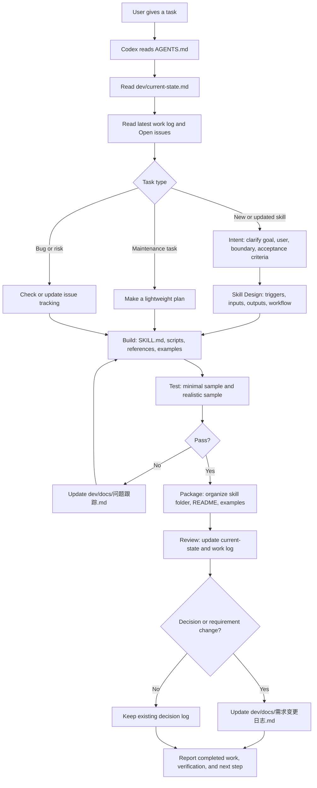
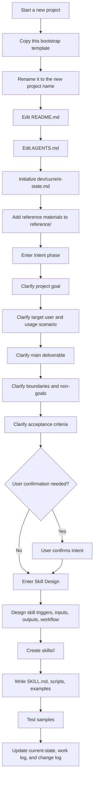

# Codex Project Bootstrap

AI coding project management skills and templates, including workflow, workspace organization, project memory, logs, and lightweight Agent skill development process.

This folder is a reusable project setup template for Codex-assisted projects.

## How To Use

Copy this whole folder to a new project location, then rename it:

```bash
cp -R codex-project-bootstrap MyNewProject
cd MyNewProject
```

Then edit:

- `README.md` for human-facing project overview
- `AGENTS.md` for Codex working rules
- `dev/docs/项目管理文档.md` for project-specific workflow
- `dev/docs/需求变更日志.md` for decisions and requirement changes

  ## 在 Trae 或本地电脑里使用

```bash
git clone https://github.com/ziyingfay/agent-project-template.git
cd agent-project-template
```

在 Trae 里打开 clone 下来的项目文件夹。
让 AI 先阅读：
- README.md
- AGENTS.md
- dev/current-state.md
  
然后对 AI 说：
请根据 AGENTS.md 和 dev/current-state.md 接管这个项目，并从 Intent 阶段开始帮我创建一个新的 Agent

## Structure

```text
ProjectName/
├── AGENTS.md
├── README.md
├── skills/
├── app/
├── reference/
├── dev/
│   ├── docs/
│   ├── notes/
│   │   └── chat-log/
│   ├── scripts/
│   └── temp/
└── outputs/
```

## Best Fit

This template is designed for small Codex-assisted projects:

- 1-3 collaborators
- AI Agent / skill development as the main output
- Lightweight planning and documentation
- Clear checkpoints without heavy enterprise process

## Principle

`AGENTS.md` tells Codex how to work. `dev/current-state.md` tells Codex where the project currently stands. `dev/` keeps project memory. `reference/` keeps background material. `skills/` keeps Agent skills. `app/` is optional for supporting web apps or demos. `outputs/` keeps external deliverables.

## Who Reads What

| File | Main reader | Purpose |
|------|-------------|---------|
| `README.md` | Humans | Explains what this project is, how to use it, and how the workflow works |
| `AGENTS.md` | Codex / AI Agent | Defines the working rules Codex should follow |
| `dev/current-state.md` | Humans + Codex | Records the current phase, focus, completed work, and next step |
| `dev/docs/*` | Humans + Codex | Stores decisions, issues, tests, milestones, and skill design notes |

## Lightweight Skill Workflow

For most personal Agent projects, use this simplified flow:

1. Intent - clarify goal, user, success criteria, and boundaries.
2. Skill Design - define trigger conditions, workflow, inputs, outputs, and safety rules.
3. Build - implement `SKILL.md`, scripts, assets, and examples.
4. Test - run sample tasks and record pass/fail results.
5. Package - organize files so the skill can be copied or installed.
6. Review - update logs, decisions, issues, and next steps.

Only pause for explicit user confirmation after Intent, before large rewrites, and before packaging/release.

## Daily Task Flow



## New Project Flow


